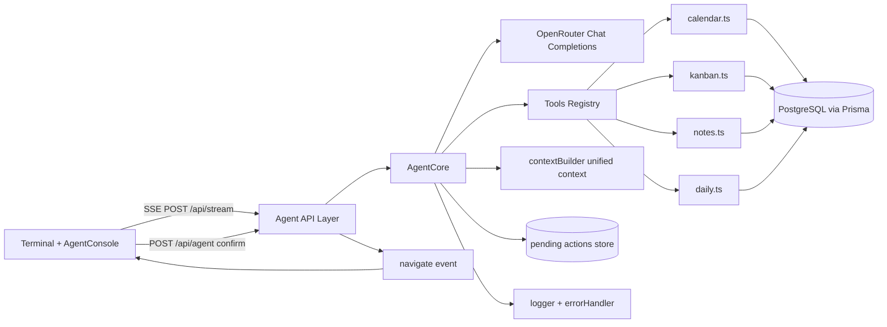

# AI Agent Integration Architecture (Variant 3: Event-Driven Orchestrator)

## 1. Цель и границы

- Агент встраивается поверх существующей `Terminal` без замены текущих slash/shell режимов.
- Не-slash запросы в режиме `slash` обрабатываются агентом.
- Любая мутация данных проходит через human-in-the-loop: `proposal -> confirm -> execute`.
- Текущая система single-workspace, но интерфейсы уже передают `workspaceId` в контексте агента.

## 2. Схема системы

## 3. Поток обработки

1. Пользователь вводит текст в `Terminal` (без `/`).
2. `useAgent` отправляет payload в `/api/stream`.
3. `AgentCore`:
   - определяет язык и интент;
   - выбирает релевантные модули;
   - собирает контекст-слепок;
   - запускает OpenRouter tool-calling loop;
   - при мутациях создаёт pending action вместо немедленного выполнения.
4. `/api/stream` отдаёт SSE события `token`, `action`, `navigate`, `done`.
5. UI показывает поток, кнопку подтверждения, и при `navigate` открывает нужный route.
6. При подтверждении UI отправляет `actionDecision`; `AgentCore` выполняет мутацию и синхронизацию linked-данных.

## 4. Доступ к данным

### Решение

- **Primary path:** серверный доступ к domain-слою (`lib/server/*`) внутри agent tools.
- **Почему не через frontend API:** меньше latency/серилизации, проще транзакционная согласованность и ACL.
- **Где API остаётся:** внешний UI и изолированные сервисные интеграции.

### Изоляция

- В каждом tool-запросе обязателен `userId`.
- В перспективе мультипользовательности: добавить `workspaceId` в модели и уникальные индексы по `(workspaceId, userId, ...)`.

### Кэш и инвалидация

- Для текущего этапа: in-request snapshot + ограничение контекста по `maxChars`.
- Для этапа масштабирования: cache-aside + invalidation event (`NOTIFY`) по изменённым сущностям.

## 5. Консистентность и единый ID

- Canonical ID: `globalEntityId`.
  - `event:<eventId>` для сущностей, связанных с календарным событием.
  - fallback: `kanban:<cardId>`, `note:<noteId>`, `daily:<id>`.
- При `calendar_*` мутациях выполняется синхронизация linked данных:
  - `KanbanCardEventLink`: обновление `title/dueDate` карточек.
  - `NoteEventLink`: обновление title заметок.
- Конфликт-правило: `calendar event` — canonical owner для linked-цепочки.

## 6. NLP и маршрутизация запроса

- `detectLanguageCode` (ru/en) по символам кириллицы.
- `classifyUserIntent`:
  - `query`, `action`, `navigate`, `clarify`, `unknown`.
- `selectRelevantModules`:
  - keyword routing + fallback на multi-module lookup.
- Для `unknown`: агент возвращает варианты интерпретации и просит уточнение.

## 7. Human-in-the-loop мутаций

- Mutating tools помечены флагом `mutating: true`.
- В tool-loop агент создаёт `pendingAction` и не выполняет write до `approved=true`.
- TTL pending action: 15 минут.
- UI: `ConfirmAction` (Confirm / Decline).

## 8. Стриминг

- Response: SSE (`text/event-stream`) в `/api/stream`.
- Event types: `token`, `action`, `navigate`, `done`, `error`.
- Интеграция с Nginx: `X-Accel-Buffering: no`.

## 9. Безопасность

- Auth gating для всех agent endpoints через `bootstrapAuth + getAuthenticatedUser`.
- Payload validation (`utils/validators.ts`).
- Mutating debug tools endpoint `/api/tools` требует `x-netden-agent-tools: 1` и `confirmMutating=true`.
- В LLM отправляется только релевантный срез контекста (`contextBuilder`), не полный дамп данных.

## 10. Наблюдаемость

- Структурный логгер (`utils/logger.ts`) + стандартизированный сериализатор ошибок.
- Метрики, которые нужно добавить на след. итерации:
  - latency LLM/tool,
  - token usage/cost,
  - confirm rate / decline rate,
  - tool error rate,
  - stale-context incidents.

## 11. Этапы внедрения

### Этап 1
- Scope: календарь read-only, базовый стриминг, ru/en ответы.
- Dependencies: `/api/stream`, language detection.
- Tests: language + simple query.
- Exit criteria: стабильный стрим + корректные read-ответы.

### Этап 2
- Scope: read по всем 4 модулям, базовый cross-module ответ.
- Dependencies: tools calendar/kanban/notes/daily.
- Tests: module relevance + context fusion.
- Exit criteria: корректные multi-module ответы.

### Этап 3 (текущий)
- Scope: tool-calling loop, session memory, pending action confirmations.
- Dependencies: pending action store + AgentCore loop.
- Tests: интент, confirmation flow, build.
- Exit criteria: ни одна мутация не выполняется без confirm.

### Этап 4
- Scope: полный CRUD + генерация контента + расширенная sync.
- Dependencies: sync policies, additional conflict checks.
- Tests: e2e CRUD with linked entities.
- Exit criteria: детерминированная sync и rollback policy.

### Этап 5
- Scope: проактивные напоминания и push notifications.
- Dependencies: service worker + subscriptions + anti-spam policy.
- Tests: reminder cadence, push dedup.
- Exit criteria: нулевая спам-нагрузка, настраиваемая частота.

## 12. Источники

- OpenRouter Streaming: https://openrouter.ai/docs/api/reference/streaming
- OpenRouter Parameters (tools/parallel): https://openrouter.ai/docs/api/reference/parameters
- OpenRouter Responses Tool Calling: https://openrouter.ai/docs/api/reference/responses/tool-calling
- OpenRouter API Overview: https://openrouter.ai/docs/api-reference/overview
- Next.js Route Handlers: https://nextjs.org/docs/app/building-your-application/routing/route-handlers
- Next.js Self-hosting headers (buffering): https://nextjs.org/docs/app/guides/self-hosting
- GitHub Copilot codebase context: https://docs.github.com/en/copilot/tutorials/explore-a-codebase
- GitHub Copilot code review context: https://docs.github.com/en/copilot/concepts/agents/code-review
- Windsurf context awareness: https://docs.windsurf.com/context-awareness/overview
- Notion MCP: https://developers.notion.com/docs/mcp
- Notion AI connectors: https://www.notion.com/help/guides/use-ai-connectors-to-access-more-of-your-teams-knowledge
- PostgreSQL LISTEN/NOTIFY: https://www.postgresql.org/docs/current/sql-listen.html, https://www.postgresql.org/docs/current/sql-notify.html
- Redis caching patterns: https://redis.io/solutions/caching/
- MDN Push API: https://developer.mozilla.org/en-US/docs/Web/API/Push_API
